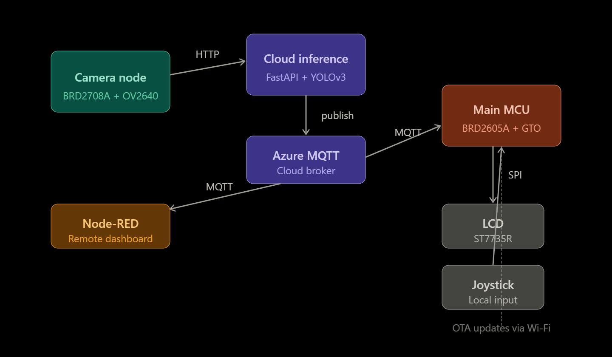
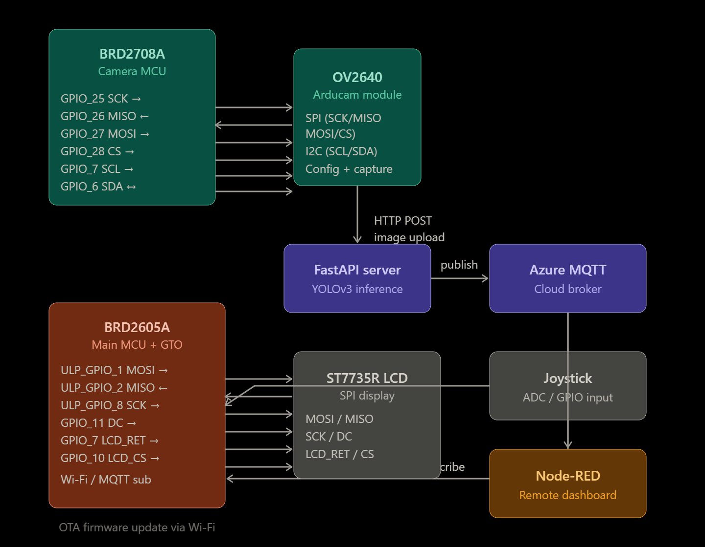
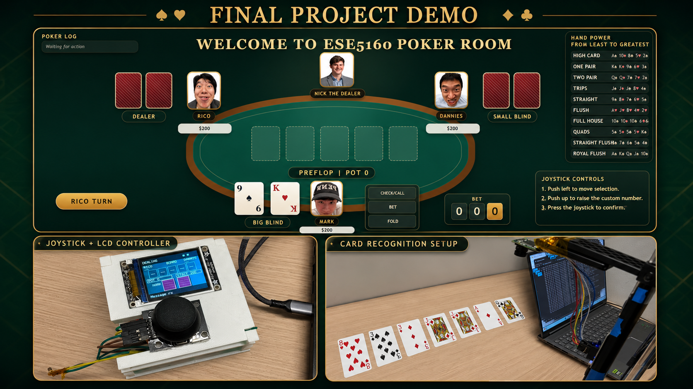
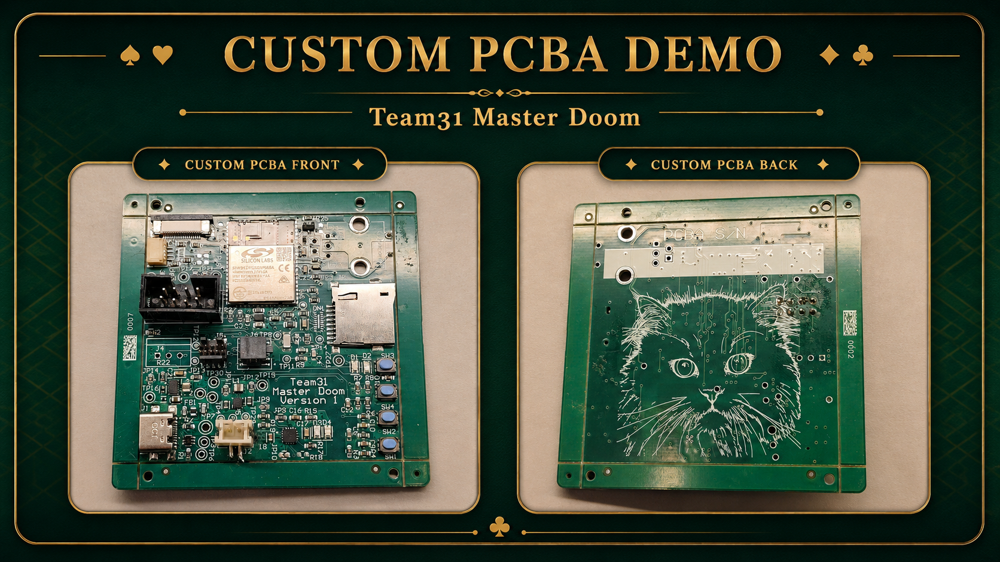
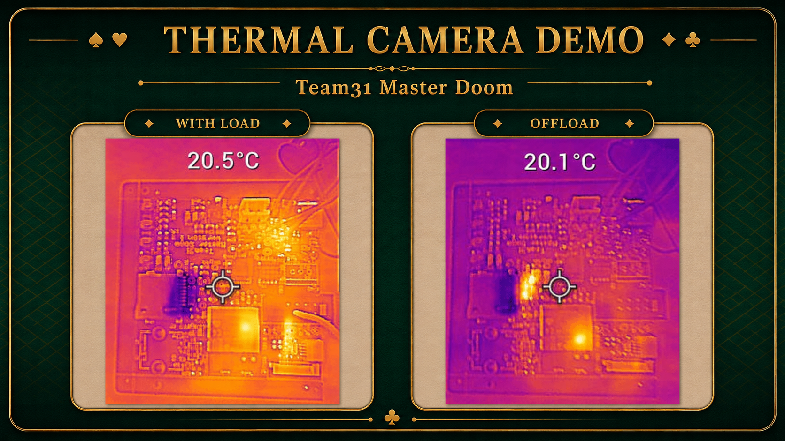
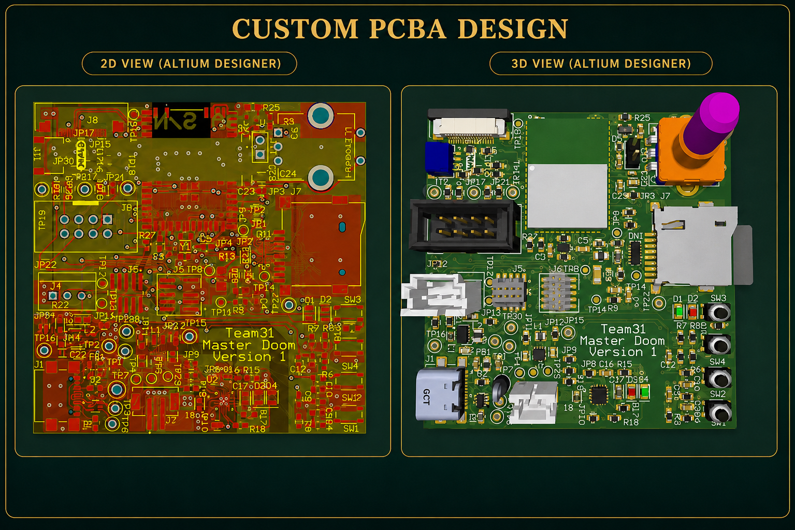
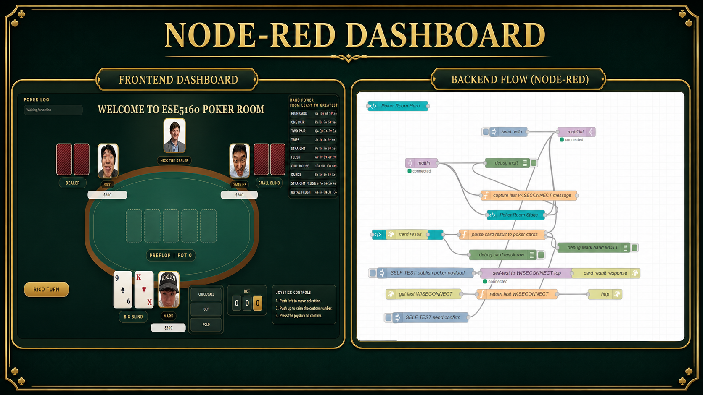

# 🃏 MasterDoom — AI Texas Hold'em Poker Assistant
**ESE5160 Spring 2026**

**Team Number: 31**

**Team Name: MasterDoom**

| Team Member Name | Email Address           | GitHub Username |
| ---------------- | ----------------------- | --------------- |
| Yunzhe Deng      | deng1@seas.upenn.edu    | yunzhedeng      |
| Jilu Wang        | jlwang25@seas.upenn.edu | Arbeiterschaft  |

**GitHub Repository URL: [https://github.com/ese5160/a11g-final-submission-s26-s26-t31-master-doom](https://github.com/ese5160/a11g-final-submission-s26-s26-t31-master-doom)**

**GitHub Pages URL: [https://ese5160.github.io/a11g-final-submission-s26-s26-t31-master-doom/](https://ese5160.github.io/a11g-final-submission-s26-s26-t31-master-doom/)**

---

## 1. Video Presentation

<section id="video-presentation">
  <h2>Team 31 MasterDoom – Texas Hold’em AI Poker Assistant Demo</h2>

<iframe
    width="100%"
    height="500"
    src="https://www.youtube.com/embed/CqMz-0Z3tis"
    title="Team 31 MasterDoom – Texas Hold’em AI Poker Assistant Demo"
    frameborder="0"
    allow="accelerometer; autoplay; clipboard-write; encrypted-media; gyroscope; picture-in-picture; web-share"
    referrerpolicy="strict-origin-when-cross-origin"
    allowfullscreen>
  </iframe>

<strong>Team 31: MasterDoom</strong>

    This project is an AI-assisted Texas Hold’em poker card recognition system.
    It uses a camera module to detect the rank and suit of playing cards in real time
    and provides GTO-based decision support to help players make better game decisions.
  

    Detected cards, game status, and decision-related information are displayed on an LCD screen.
    A joystick is used for local control and menu selection, while a Node-RED dashboard provides
    remote monitoring and user interaction.
  

    The camera, LCD, and user interface communicate wirelessly using MQTT over Wi-Fi.
    The system also supports OTA updates, allowing firmware to be updated wirelessly without
    a physical connection.
  

    Main features include poker card recognition, Texas Hold’em game display,
    GTO-based decision support, LCD real-time display, joystick control,
    Node-RED dashboard, MQTT communication, and OTA firmware updates.
  

</section>

---

## 2. Project Summary

**Device Description:**

- Our device is an AI-assisted Texas Hold’em poker assistant that uses a camera to recognize playing card rank and suit in real time. It displays game information on an LCD, supports joystick control, connects to a Node-RED dashboard through MQTT over Wi-Fi, and supports OTA firmware updates.
- Our project was inspired by the fact that GTO-based poker algorithms can often make stronger and more consistent decisions than human players in Texas Hold’em. We wanted to give this type of algorithm vision, display, wireless communication, and user input so it could interact with a real poker table more like a human player. The problem our device solves is that most poker decision-support algorithms only work with manually entered card and game information. Our system helps bridge the gap between software strategy and the physical world by recognizing cards with a camera, showing game information on an LCD, and allowing users to interact with the system through a joystick and Node-RED dashboard.
- We use the Internet through Wi-Fi and MQTT to connect the camera, MCU, and Node-RED dashboard. Most importantly, the camera sends detected card rank and suit information to the MCU through MQTT, so the MCU can update the LCD, process game information, and support remote monitoring and OTA firmware updates.

**Device Functionality:**

- The MasterDoom system integrates computer vision, embedded processing, and wireless communication to deliver real-time poker decision support.

- The Arducam OV2640 camera module captures images of playing cards via SPI/I2C and transmits them to a backend server over HTTP. A FastAPI server receives the image and runs inference using a custom-trained YOLOv3 model to detect each card's rank and suit. Results are published back to the MCU via a cloud-based MQTT broker.

- The SiWG917 MCU (BRD2605A) receives detected card data, runs a custom GTO-based poker decision algorithm, and renders the current game state and recommended action on an SPI-connected LCD in real time. A joystick provides local menu navigation and game state input.

- A Node-RED dashboard subscribes to the same MQTT broker for remote monitoring and user interaction. The system also supports OTA firmware updates over Wi-Fi, enabling wireless MCU reprogramming without physical access.

**Challenges**:

- On-Device CV Infeasible Due to MCU Memory Constraints
The original design aimed to run card recognition locally on the SiWG917. However, with only 320KB of RAM, input images had to be downscaled to 96×96 pixels — a resolution too low for reliable card rank and suit detection. The approach was abandoned in favor of a cloud-based inference pipeline using FastAPI + YOLOv3.

- End-to-End Pipeline Instability Over the Internet
Running the full pipeline — image capture, HTTP upload, YOLOv3 inference, and MQTT result delivery — over a cloud connection introduced latency and reliability issues. Network interruptions at any stage could stall or break the recognition loop, making consistent real-time performance difficult to guarantee.

- SiWG917 Custom PCB Flashing Failure
When attempting to move from the development board to a custom PCB using the SiWG917 IC, the team encountered a critical flashing issue where new firmware could not be written to the chip. Despite extensive debugging efforts, the root cause could not be resolved, and the team continued development on the standard development board.

**Prototype Learnings:**

- Camera Stability and Image Quality
The Arducam OV2640 performed reliably in practice, and the native capture resolution proved sufficient for YOLOv3 to accurately detect card rank and suit — validating the camera hardware choice despite the shift to cloud-based inference.

- Form Factor Matters for Real-World Use
A key takeaway is that miniaturizing the overall system should be a priority in future iterations. Reducing the size of all components would make the device concealable and practical enough to function as a genuine real-time poker assistant at a real table.

- PCB Design and Model Training Lessons
The custom PCB process taught the team several important hardware design principles, including debounce circuit design, avoiding copper polygons beneath the antenna to prevent RF interference, and proper trace routing. On the software side, the team gained hands-on experience with data annotation for object detection — the process of manually labeling card images to train the YOLOv3 model.

- Input Method Refinement
The team initially planned to use a larger touchscreen LCD for user input, but concluded that a smaller display paired with a joystick was better suited to the project's portability and usability goals. This change simplified the interface while keeping the device compact.

**Next Steps & Takeaways:**

- One major improvement is to make the network communication more stable. Sometimes the game becomes delayed or stuck because of Wi-Fi or MQTT connection issues, so we need to improve message handling, add better reconnection logic, and reduce communication latency.
- Through ESE5160, we learned how to build a complete connected embedded system from hardware to cloud. The lectures and assignments helped us understand PCB design, sensor and actuator integration, MQTT communication, Node-RED dashboards, and OTA firmware updates. The final project helped us combine all of these parts into one working prototype and taught us how to debug both hardware and software problems in a real system.

**Project Links**:

[Node Red Link](http://4.154.36.28:1880)

[Altium PCBA Link](https://upenn-eselabs.365.altium.com/designs/907BC697-1F1F-4DA7-AD57-F23FF5449B87#design)

---

## 3. Hardware & Software Requirements

## Hardware Requirements Specification (HRS)

| ID | Requirement |
|---|---|
| HRS-01 | The system shall use the SiWG917 (BRD2605A) as the main MCU for game logic, LCD rendering, joystick input, MQTT communication, and OTA updates. |
| HRS-02 | The system shall use the SiWG917 (BRD2708A) as the camera node MCU, responsible for image capture and HTTP transmission to the inference server. |
| HRS-03 | The Arducam Mini OV2640 camera module shall communicate with the camera MCU via SPI and I2C, and shall capture images at sufficient resolution for card recognition. |
| HRS-04 | The ST7735R LCD shall be driven over SPI and shall display card detection results, game state, and GTO recommendations in real time. |
| HRS-05 | The joystick shall provide local user input for menu navigation and manual game state entry. |
| HRS-06 | The custom PCB shall supply a regulated 3.3V and 5V output to power all onboard components, with no copper polygons beneath the antenna region to prevent RF interference. |
| HRS-07 | The system shall operate over a 2.4GHz Wi-Fi connection for MQTT communication and HTTP image upload. |

## Software Requirements Specification (SRS)

| ID | Requirement |
|---|---|
| SRS-01 | The card recognition pipeline (image capture → HTTP upload → YOLOv3 inference → MQTT delivery → LCD display) shall complete end-to-end in under 3 seconds under normal network conditions. |
| SRS-02 | The YOLOv3 model, trained and annotated via Roboflow, shall achieve a card recognition accuracy of at least 90% across all 52 standard playing cards. |
| SRS-03 | The FastAPI inference server shall receive images from the camera node, run YOLOv3 inference, and publish detected card rank and suit results to the Azure MQTT broker. |
| SRS-04 | The main MCU shall subscribe to the Azure MQTT broker and update the LCD display within 1 second of receiving card detection results. |
| SRS-05 | The GTO decision algorithm shall evaluate the current hand and community cards and output a recommended action (fold, call, raise, or check) for every game state update. |
| SRS-06 | The Node-RED dashboard shall subscribe to the Azure MQTT broker and display live game state, detected cards, and GTO recommendations for remote monitoring. |
| SRS-07 | The system shall support OTA firmware updates over Wi-Fi, allowing the main MCU to be reprogrammed without a physical connection. |

---

## 4. Project Photos & Screenshots

---

## 5. Codebase

- Link to final embedded C firmware codebases
  [Codebases Link](https://github.com/yunzhedeng/ese5160_finalproject)
- Link to Node-RED dashboard code
  [Node-Red dashboard link](https://github.com/yunzhedeng/ese5160_finalproject/tree/main/mqtt)
